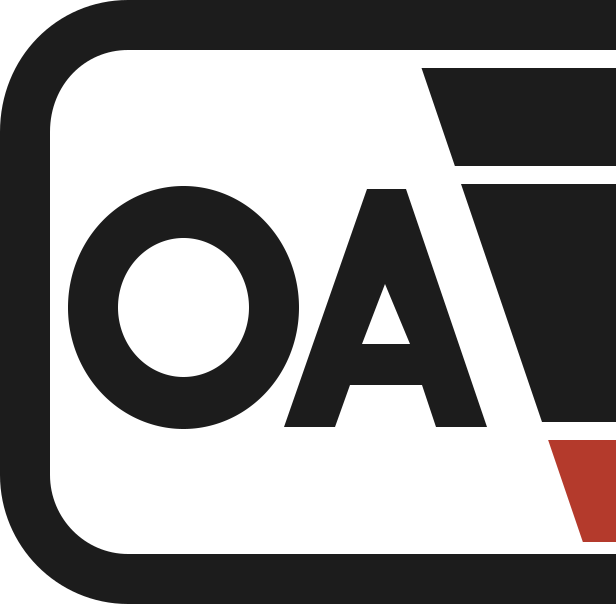

<!-- Copyright (c) 2026 Remgrandt Works. All rights reserved. -->

<p align="center">
  <picture>
    <source media="(prefers-color-scheme: dark)" srcset="public/oac-logo-dark-mode.svg">
    <source media="(prefers-color-scheme: light)" srcset="public/oac-logo-light-mode.svg">
    
  </picture>
</p>

# OA Curator

Local-first desktop catalog for original art collectors.

OA Curator helps collectors keep a private, durable catalog of original art scans, metadata, gallery-site links, notes, and export-ready files on their own computer. It is built to complement community gallery sites without making a collection depend on any one website.

## Public Beta

This public repository exists for official distribution and source disclosure. It lets users inspect what OA Curator does and build an unmodified copy for personal use under the license.

OA Curator is freeware, not open source. This project is not accepting third-party code contributions, pull requests, modified builds, repackaging, or redistribution unless Remgrandt Games LLC authorizes them in writing.

Official builds and release assets are distributed by Remgrandt Works.

## License

OA Curator is source-available freeware. You may view, build, install, and use unmodified copies under the terms in [LICENSE](LICENSE).

All rights not expressly granted in the license are reserved. See [LEGAL.md](LEGAL.md) for publisher and trade-name information.

## What It Does Today

- Create and open local Collections, Galleries, and Artworks.
- Attach JPG, PNG, and TIFF scans by copying them into a Collection or linking to their existing location.
- Attach generic supporting files such as PDF, PSD, HEIC, AVIF, WebP, ZIP, or documents without treating them as renderable images.
- Generate cached thumbnails and previews without modifying original files.
- Import ComicArtFans and SNIKT.com CSV metadata.
- Import and export OAA archives for portable collector-owned data.
- Edit public metadata, gallery-site URLs, artist credits, and private collector fields.
- Generate Basic and Premium PNG derivatives for web workflows.
- Export Raremarq bulk-upload CSV files.
- Open SNIKT.com upload-prefill URLs for browser-assisted publishing.

## What It Does Not Do

- No cloud sync or hosted collection storage.
- No mobile app.
- No direct ComicArtFans upload automation.
- No ComicArtFans, SNIKT.com, or Raremarq site scraping.
- No automatic artist assignment from folder names.
- No editing original image pixels during cataloging, viewing, thumbnailing, or export preparation.
- No rendering PDF, PSD, HEIC, AVIF, WebP, or similar attachment formats as images.

## Safety Model

OA Curator is local-first. Core cataloging, browsing, metadata editing, file organization, and export preparation are designed to work offline.

Original scans are source assets. Thumbnails, previews, and PNG exports are separate generated files. The app should not overwrite original image pixels.

Purchase price, estimated value, purchase date, provenance, and personal notes are private collector fields. Public sharing workflows should exclude private fields by default unless the collector deliberately includes them.

Move and rename workflows are expected to use preview, validation, no-overwrite checks, explicit confirmation, and operation logging before physical files are changed.

## Build An Unmodified Copy

Prerequisites:

- Node.js 22 or newer and npm.
- Rust stable with the MSVC toolchain on Windows.
- Windows: Microsoft C++ Build Tools and WebView2 for Tauri.
- Python 3.12 or newer for building the offline user guide.

Install dependencies:

```powershell
npm ci
python -m pip install -r requirements-docs.txt
```

Run source checks used by the release package:

```powershell
npm run check:release
```

Build the Windows desktop installer locally:

```powershell
npm run release:windows
```

Official signed releases require Remgrandt-controlled signing credentials and updater keys. Personal unmodified builds are allowed only within the limits of [LICENSE](LICENSE).

## Documentation And Notices

User documentation lives in `docs/user` and builds into the app's offline help.

Project attribution notes for bundled visual, theme, and UI resources live in [ATTRIBUTIONS.md](ATTRIBUTIONS.md).
