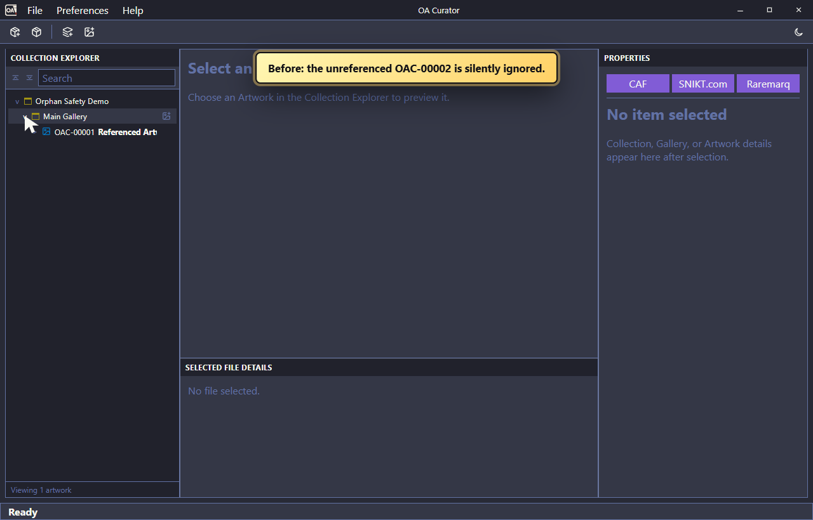
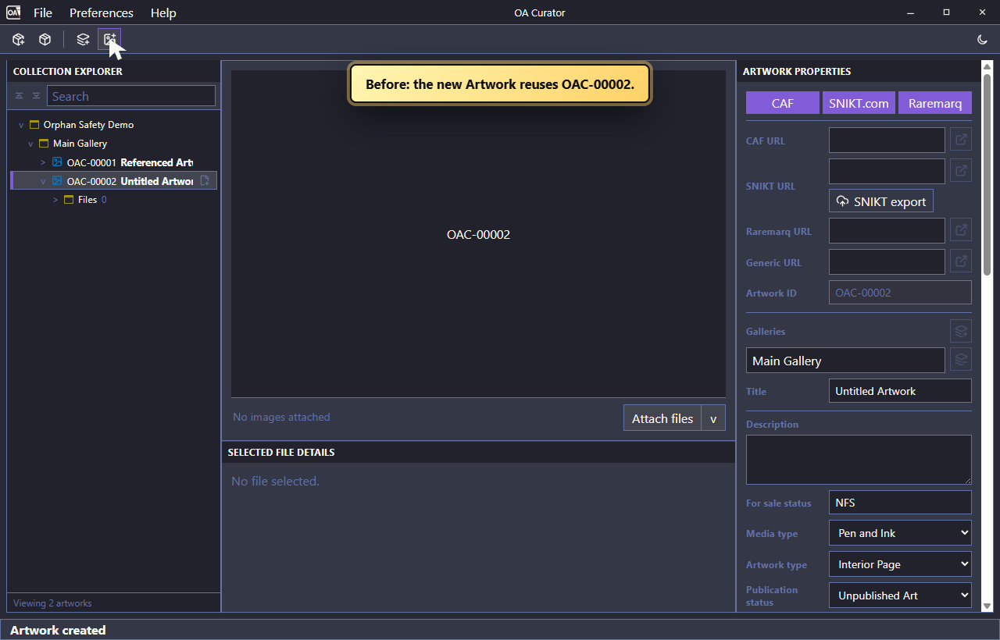
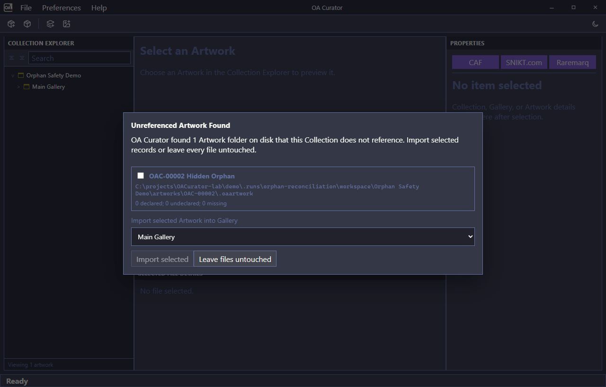
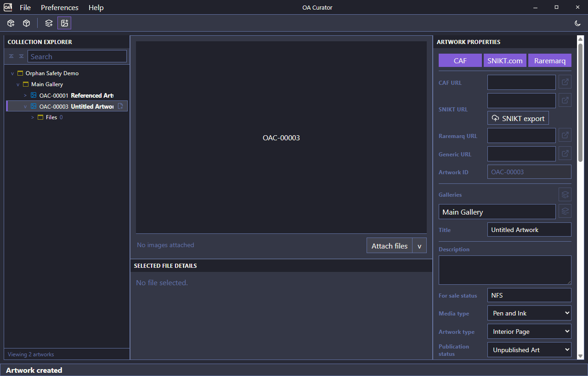

# Orphan Reconciliation and Manifest Safety Fix Report

Date: 2026-07-20

## Outcome

OA Curator no longer overwrites an unreferenced Artwork folder when allocating a new local Artwork ID. Opening a Collection now reports Artwork manifests that exist under the Collection's managed `artworks` folder but are absent from `.oacollection`, and the user can explicitly import selected records or leave every file untouched.

The live Collection at `C:\Users\grant\OACurator\Remgrandt's Collection` was not opened, modified, migrated, or used for testing. All reproduction and verification used repository fixtures and disposable temporary Collections.

## What was established

The incident exposed several separate failure modes:

1. ID allocation used the highest ID in the SQLite working catalog. Because the catalog is intentionally rebuilt only from `.oacollection`, an unreferenced on-disk Artwork could occupy the next ID without being visible to the allocator.
2. New Artwork manifest creation used an overwrite-capable path. An occupied ID could therefore replace the existing `.oaartwork` content.
3. Collection opening intentionally ignored unreferenced Artwork manifests without telling the user.
4. Manual Artwork creation contained a cleanup pass that deleted unlinked runtime rows. Under intended use it was unnecessary, and during a partial failure it could erase useful evidence.
5. JSON manifest updates wrote directly to the destination file. This affected one manifest file per write; OA Curator was **not** serializing or writing hundreds of Artwork manifests simultaneously. Direct replacement still allowed the destination to be truncated before a complete replacement was safely ready.
6. File-operation and manifest-projection diagnostics were tied to transient database row IDs and cleared during catalog rebuild, so reopening could erase evidence needed to understand a failure.

The available evidence does **not** establish what produced the specific metadata/file drift observed in OAC-00826. This work makes the known destructive path reproducible and fixes it, but does not assign OAC-00826 to that path without stronger forensic evidence.

## Before

The disposable regression Collection contained referenced OAC-00001 and an unreferenced OAC-00002 manifest. The previous open flow silently showed only the referenced Artwork.

Creating another Artwork then reused OAC-00002 and replaced the existing manifest.

## Fixes implemented

### 1. Collision-safe ID allocation and no-clobber creation

- The `.oacollection` manifest remains authoritative; no durable ID high-water mark was added.
- Allocation still begins from the hydrated working catalog, but every candidate ID is checked against the managed Artwork folder and `.oaartwork` path on disk.
- Occupied manifest folders and directory-only collisions are skipped.
- Installing a brand-new `.oaartwork` uses a no-clobber operation. Even if a collision appears after allocation, creation fails instead of replacing it.
- Explicit custom manifest paths receive the same no-clobber protection.

### 2. Explicit orphan reconciliation on Collection open

- OA Curator performs a read-only scan after each user-visible Collection open.
- It compares managed Artwork folders with the paths referenced by `.oacollection`.
- The dialog reports the canonical ID, title, path, declared/missing/undeclared file counts, invalid-manifest errors, and possible exact-title duplicates.
- Invalid JSON, ID/folder mismatches, invalid OAC IDs, duplicate referenced IDs, and unsafe attachment paths are visible but cannot be imported.
- The user can select safe records and choose a destination Gallery, or choose **Leave files untouched**.
- Ignoring the prompt performs no repair write. Those folders consequently remain outside `.oacollection` and outside OAA export, as designed.
- Importing links the existing record into the selected Gallery and Collection without rewriting the discovered `.oaartwork` file.

### 3. Removed the unlinked-row cleanup step

The pre-creation cleanup function and its call were removed. Runtime records are kept current by normal add/delete operations; a partial create failure is handled as a failure, not by a silent cleanup pass.

### 4. Safer per-manifest replacement

- JSON is serialized into a sibling temporary file first.
- The temporary file is flushed and synchronized before installation.
- Existing manifests are replaced only with a completed staged file.
- New manifests use no-clobber installation.
- Artwork creation stages the affected Artwork, Gallery, and Collection documents before installing any of them.

This is per-file replacement, not a single write of the whole Collection tree. A filesystem cannot provide one atomic transaction spanning three separate files and SQLite. The operation therefore installs in recoverable order: new Artwork first, Gallery next, `.oacollection` last, then commits SQLite. If a later phase fails, the runtime record is rolled back, it is not exposed as a successful UI record, and the error explains which durable files may exist. On the next open, the reconciliation scan exposes an unreferenced Artwork manifest rather than silently ignoring or overwriting it.

Nested Artwork creation during a larger import uses a SQLite savepoint, preserving the outer import transaction.

### 5. Coherent UI failure behavior

- The UI receives a successful Artwork only after the affected manifests and SQLite transaction have completed.
- A detectable failure returns a phase-specific warning instead of displaying a record that was not durably added to the Collection.
- Failures after a new `.oaartwork` was installed explicitly tell the user that reopening will offer it for reconciliation.

### 6. Durable diagnostic history

- Catalog rebuild no longer deletes `file_operation_log` or `manifest_projection_state`.
- Diagnostic rows now retain stable Collection/Artwork identifiers and manifest/file paths rather than depending solely on transient SQLite row IDs.
- Projection repair resolves the current runtime row by its stable manifest path. An issue for an unloaded record remains recorded instead of disappearing.
- Existing databases using the old diagnostic schemas are migrated without discarding their rows; unresolved legacy IDs receive explicit fallback stable identifiers.

## After

Opening the same disposable Collection now reports the unreferenced manifest and asks for a decision. The compact checkbox is enabled for a safe, importable record; invalid records would remain visible but disabled.

After choosing **Leave files untouched**, creating a new Artwork skips occupied OAC-00002 and creates OAC-00003. The automated scenario also verifies the OAC-00002 manifest bytes are unchanged and `.oacollection` references exactly OAC-00001 and OAC-00003.

## Regression coverage

New or expanded tests prove:

- creation skips an unreferenced manifest folder and leaves its bytes unchanged;
- creation also skips a directory-only collision;
- an explicitly supplied occupied manifest path cannot be overwritten;
- completed updates replace an existing JSON manifest, while new writes never clobber one;
- unreferenced Artwork inspection and import preserve the discovered `.oaartwork` file;
- malformed unreferenced records are reported but cannot be imported;
- the frontend offers import/ignore choices and sends only the selected paths and Gallery;
- file-operation logs survive catalog rebuild and Collection reopen;
- manifest-projection issues survive reinitialization;
- old diagnostic-table rows survive schema migration;
- OAA merge import remains valid when Artwork creation is nested in its transaction;
- the desktop end-to-end scenario validates the prompt, ignore path, unchanged orphan, and collision-safe OAC-00003 creation.

## Verification results

- `npm run check:frontend`: passed — TypeScript, demo TypeScript, ESLint, Prettier, and 240 frontend tests.
- `npm run check:backend`: passed — Rust formatting, Clippy with warnings denied, and 198 active backend tests; 4 profiling harnesses remain intentionally ignored.
- `npm run docs:build`: passed in strict mode.
- `npm run build:frontend`: passed, including the release-bundle guard.
- `git diff --check`: passed.
- `npm run demo:run:core -- --scenario orphan-reconciliation --slow 0`: passed against the freshly built Tauri desktop application, 1 scenario/1 test.

`npm run check:full` could not run as a single uninterrupted wrapper because its first, unrelated repository guard currently fails: `scripts/install-libvips-windows.ps1` does not contain the `Get-FileHash` text required by `scripts/check-libvips-runtime-lock.mjs`. Neither script was changed for this work. Every subsequent component of `check:full` relevant to these changes was run independently and passed as listed above.

## Deliberate boundaries

- `.oacollection` remains the authoritative at-rest membership record.
- An orphan the user elects to ignore remains untouched and excluded from OAA backup/export.
- No automatic repair was run against the live Collection.
- Repair of the existing OAC-00816 through OAC-00826 situation should be a separate, read-only inventory first, followed by a backup and an explicitly approved import/repair plan.
- No causal claim is made about OAC-00826 beyond the directly observed drift.
