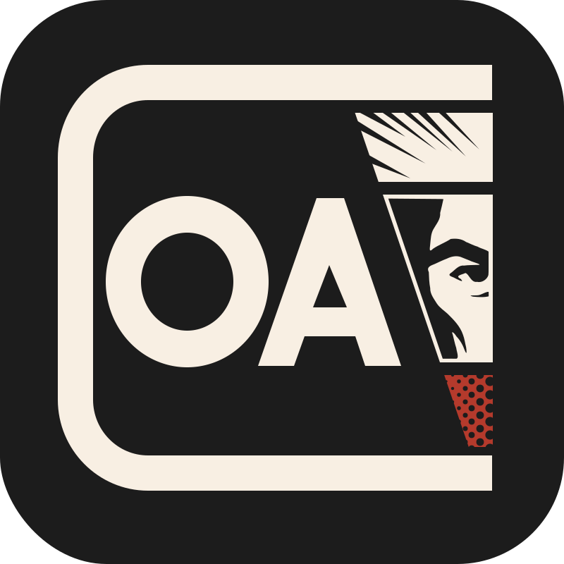

# OA Curator User Guide

{ .oac-doc-logo }

OA Curator helps original art collectors keep a local catalog of their scans, organize pieces into Collections and Galleries, prepare web-ready images, and move their data between tools without surrendering control of the collection.

The basic structure is simple:

- A **Collection** is the top-level workspace.
- A **Gallery** is a room or grouping inside a Collection.
- An **Artwork** is one original art piece, with its metadata, images, links, and exports.

OA Curator is local-first. Your catalog and image files live on your computer unless you choose to import, export, open a gallery site URL in your browser, or use a workflow that uploads temporary files.

## Demo

  <iframe
    src="https://www.youtube-nocookie.com/embed/zabLc93Qft0"
    title="demo"
    loading="lazy"
    allow="accelerometer; autoplay; clipboard-write; encrypted-media; gyroscope; picture-in-picture; web-share"
    referrerpolicy="strict-origin-when-cross-origin"
    allowfullscreen>
  </iframe>

## What This Build Supports

The current application supports the core cataloging flow:

- Create, open, and close Collections.
- Create Galleries and select them while browsing a Collection.
- Create Artworks inside a Gallery.
- Assign an Artwork to more than one Gallery.
- Import ComicArtFans CSV metadata.
- Import SNIKT.com CSV metadata.
- Import and export OAA archives.
- Attach JPG, PNG, and TIFF images by copying them into the Collection or linking to their current location.
- Browse thumbnails and previews.
- Edit artwork metadata, gallery-site links, artist credits, SNIKT.com fields, and private collector notes.
- Set image roles, such as Raw Scan, Detail, Verso, Basic, or Premium.
- Create PNG exports in Basic 800px-height or Premium 2000px-height formats.
- Export the open Collection to Raremarq's bulk-upload CSV format.
- Open supported SNIKT.com upload-prefill workflows.

Raremarq currently does not provide a bulk export file. OA Curator does not scrape ComicArtFans, SNIKT.com, or Raremarq pages.

## Why OA Curator Exists

Websites are useful, but they should not be the only copy of your collection data. OA Curator is designed around the idea that your catalog should remain portable, readable, and under your control.

That is why OA Curator supports OAA, the Original Art Archive format. OAA is the portable archive format for moving original art collection data and files between tools. You do not need to understand the full technical format to use OA Curator, but you should know that OAA is the app's path toward collector-owned data.

For the full OAA specification, see [Original-Art-Archive/oaa-spec](https://github.com/Original-Art-Archive/oaa-spec).

## Preservation First

Original scans are treated as source files. Browsing, thumbnails, previews, metadata edits, and PNG exports should not overwrite or alter your original image pixels.

Private collector fields, such as purchase price, estimated value, purchase date, provenance, and personal notes, are for your local records. Public sharing workflows should keep those fields out unless you deliberately include them.
